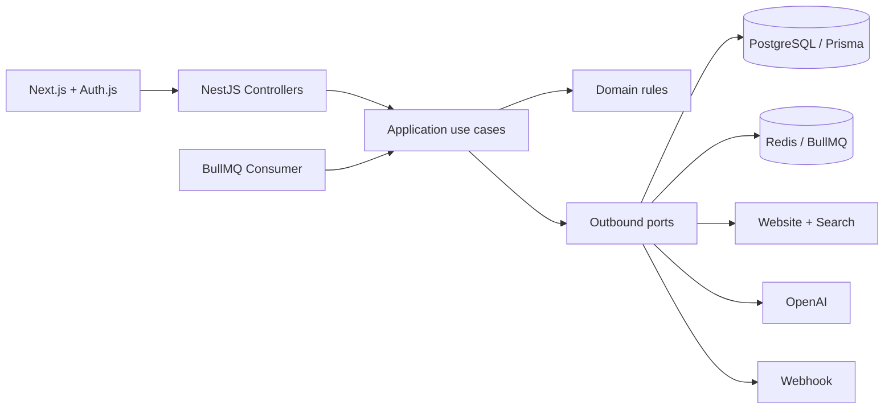

# Growth Batch OS — Caso técnico Xepelin

Pipeline end-to-end para transformar batches de empresas en pipeline ejecutable para SDRs: valida, deduplica, enriquece contactabilidad, recopila contexto público y genera un approach personalizado con AI.

La implementación prioriza **claridad, capacidad de prueba y velocidad de entrega**. Usa arquitectura hexagonal sólo en límites que realmente pueden fallar o cambiar —DB, cola, búsqueda, LLM y webhook— evitando abstracciones ceremoniales.

## Qué incluye

- API NestJS con los cuatro endpoints solicitados.
- Worker persistente BullMQ con concurrencia, retries y manejo de jobs estancados.
- PostgreSQL/Prisma con batches, leads, eventos y entregas de webhook.
- Frontend Next.js protegido por Auth.js, con login demo o Google OAuth.
- AI-enrichment estructurado y validado con Zod.
- Providers demo determinísticos para ejecutar los 20 leads sin credenciales.
- Providers live para homepage + Brave Search o Wikipedia + OpenAI Responses API.
- Botón de prueba real protegido por capacidades: sólo se habilita con OpenAI y public info live, webhook demo y presupuesto visible.
- Protección básica contra SSRF, timeouts e idempotency key del webhook.
- Tests del dominio y del caso de uso principal.

## Arquitectura



El dominio no importa NestJS, Prisma, BullMQ ni OpenAI. `@xepelin/core` concentra reglas y casos de uso; `@xepelin/infrastructure` implementa los adaptadores; API y worker son adaptadores de entrada.

### State machine

```text
pending → processing → ready → ai_enriching → ai_ready
                    ↘ failed              ↘ ai_failed
```

Los estados sólo cambian mediante `LeadRepository.transition`, que valida la máquina de estados y usa compare-and-set en PostgreSQL. Cada cambio queda trazado en `BatchEvent`.

## Arranque local

Requisitos: Node 20+, pnpm 9+, Docker Desktop.

```bash
cp .env.example .env
docker compose up -d postgres redis
pnpm install
pnpm db:generate
pnpm db:migrate
pnpm dev
```

Servicios:

- UI: <http://localhost:3000>
- API: <http://localhost:3001/api>
- Health: <http://localhost:3001/health>

Entrar con **Entrar al demo**. Luego usar **Ejecutar batch demo** o:

```bash
pnpm demo:seed
```

Resultado esperado del Anexo A:

- 20 leads totales.
- 16 `ai_ready`.
- 2 `failed/duplicate`.
- 1 `failed/invalid_url`.
- 1 `failed/invalid_url` por website vacío.
- Batch `completed` y una entrega lógica de webhook.

## API

### `POST /api/batches`

```json
{
  "name": "Outbound MX - Batch demo Q1",
  "segment": "pyme_servicios",
  "owner_email": "sdr.demo@xepelin.com",
  "webhook_url": "https://webhook.site/uuid",
  "execution_mode": "demo",
  "leads": [
    {
      "legal_id": "MAGE920101AB1",
      "legal_name": "Manufacturas Aguila SA de CV",
      "website": "https://manufacturasaguila.mx"
    }
  ]
}
```

### Otros endpoints

- `GET /api/batches`: listado con métricas.
- `GET /api/batches/:id`: detalle, leads, eventos y webhooks.
- `POST /api/batches/:id/retry-failed`: reinicia sólo fallos reintentables.

Los errores permanentes (`duplicate`, `invalid_url`, `missing_legal_id`) se reportan como `skipped`; timeouts, rate limits, 5xx y errores transitorios de providers pueden reintentarse.

## Providers demo y live

El modo por defecto es reproducible:

```env
AI_PROVIDER=demo
PUBLIC_INFO_PROVIDER=demo
```

Para ejecutar providers reales:

```env
AI_PROVIDER=openai
PUBLIC_INFO_PROVIDER=live
WEBHOOK_PROVIDER=live
OPENAI_API_KEY=...
OPENAI_MODEL=gpt-5-mini-2025-08-07
# Opcional: si se omite, la segunda fuente usa Wikipedia.
BRAVE_SEARCH_API_KEY=...
```

Para que la UI refleje las capacidades reales, `AI_PROVIDER`, `PUBLIC_INFO_PROVIDER`, `WEBHOOK_PROVIDER` y la presencia opcional de `BRAVE_SEARCH_API_KEY` deben configurarse como variables compartidas entre API y worker. El endpoint de capacidades sólo publica nombres y modos; nunca devuelve valores de credenciales.

Cada batch persiste `execution_mode` (`demo` por defecto o `live`). Esto permite mantener ambos botones disponibles: el fixture demo selecciona adaptadores determinísticos sin costo ni tráfico externo, mientras la prueba real exige providers live y solicita una URL explícita de Webhook.site. El adaptador HTTP bloquea hosts privados y redirects para reducir el riesgo de SSRF.

El adapter OpenAI usa Responses API + Structured Outputs y vuelve a validar el resultado con Zod. Se usa un snapshot de `gpt-5-mini` para controlar regresiones; el modelo soporta Structured Outputs y su precio publicado es USD 0,25/M tokens de entrada y USD 2/M de salida: <https://developers.openai.com/api/docs/models/gpt-5-mini>.

### Evidencia controlada de un LLM real

La suscripción de ChatGPT y la facturación de la API son independientes. Además, `gpt-5-mini` no admite el tier gratuito. Por eso, la prueba real sólo se habilita cuando la cuenta API tiene crédito promocional disponible; de lo contrario no debe ejecutarse.

1. Revisar el saldo en <https://platform.openai.com/settings/organization/billing/overview> y crear una API key de proyecto en <https://platform.openai.com/api-keys>.
2. Guardar la key únicamente en `.env` y marcar la confirmación local:

```env
OPENAI_API_KEY=sk-...
OPENAI_FREE_CREDIT_CONFIRMED=true
```

3. Inspeccionar el plan sin consumir la API:

```bash
pnpm proof:openai
```

4. Ejecutar exactamente un lead, sin búsqueda pagada y con un máximo de 1.200 tokens de salida:

```bash
pnpm proof:openai -- --confirm-live-call
```

La ejecución crea `docs/evidence/openai-live-proof.json` con el ID de respuesta, modelo, latencia, tokens, costo estimado y output validado. Nunca escribe la API key. El adaptador usa `store: false`, por lo que OpenAI no conserva la respuesta para recuperarla posteriormente mediante la API.

Los enrichments procesados por el worker también persisten metadata neutral del proveedor (`provider`, modo, modelo, response ID, uso, latencia y costo estimado). El detalle del batch muestra un badge **LLM real** o **Demo** y permite inspeccionar la ejecución. Los batches creados antes de esta migración conservan su output, pero aparecen como `Sin telemetría · batch anterior`.

Para una demo live de bajo costo en Railway, configurar sólo el worker con:

```env
AI_PROVIDER=openai
OPENAI_API_KEY=...
OPENAI_MODEL=gpt-5-mini-2025-08-07
PUBLIC_INFO_PROVIDER=demo
```

Después del deploy debe crearse un batch nuevo: los resultados existentes no se reprocesan ni se etiquetan retroactivamente como OpenAI.

### Batches sintéticos para observar el LLM

`fixtures/llm-evaluation-batches.json` agrega tres escenarios determinísticos:

| Escenario | Leads | Llamadas AI esperadas | Qué permite observar |
|---|---:|---:|---|
| `supply-chain-cl` | 3 | 3 | Inventario, logística y construcción |
| `services-mx` | 3 | 3 | Contraste entre software, consultoría y distribución |
| `resilience-mixed` | 4 | 2 | Dos válidos, un duplicado y una URL inválida |

El provider público `demo` genera dos fuentes sintéticas diferenciadas por sector: un sitio propio y un directorio B2B adicional. Esto mantiene toda la demo libre de datos reales. El adapter `live` implementa la misma capacidad con HTML del sitio oficial y el primer resultado de Brave Search.

El runner es dry-run por defecto y muestra antes de ejecutar el número máximo de llamadas y su costo estimado:

```bash
pnpm demo:seed:llm
```

Para crear sólo el escenario de supply chain y esperar su resultado:

```bash
API_URL=https://<dominio-api>/api \
WEB_URL=https://<dominio-web> \
pnpm demo:seed:llm -- --scenario supply-chain-cl --confirm-create
```

Para crear los tres escenarios se omite `--scenario`. Son ocho llamadas AI válidas como máximo; usando el costo de la prueba live anterior, el presupuesto esperado es cercano a USD 0,009. El reporte final incluye estados, fuentes, score, justificación, ice-breaker, pain hypothesis, modelo, tokens, latencia, costo y webhook.

### Matriz de cumplimiento del pipeline AI

| Requisito | Implementación |
|---|---|
| `ready → ai_enriching` | La máquina de estados y `ProcessLead` hacen ambas transiciones explícitas |
| Sitio + fuente adicional | `DemoPublicInfoProvider`: dos fuentes sintéticas; `LivePublicInfoProvider`: sitio + Brave Search o fallback gratuito a Wikipedia |
| Output estructurado | Responses API con Structured Outputs y schema Zod |
| Persistencia y terminalidad | Output y metadata se guardan antes de `ai_ready`; fallas terminan en `ai_failed` con razón tipada |
| Vista detalle | Score, justificación, ice-breaker, pain hypothesis, evidencia, telemetría live/demo y tiempos end-to-end por lead y batch |
| Cierre y webhook | El batch espera todos los estados terminales y emite un único evento lógico idempotente |

### Prompt

El system prompt impone cuatro restricciones:

1. Usar exclusivamente evidencia entregada.
2. No inventar facturación, dolores financieros ni eventos.
3. Declarar el dolor como hipótesis.
4. Evaluar fit con pagos, gestión financiera y capital de trabajo.

Output obligatorio:

```ts
{
  prospect_fit_score: number; // 0-100
  fit_justification: string;
  ice_breaker: string;
  pain_hypothesis: string;
  confidence: "low" | "medium" | "high";
  evidence: string[];
}
```

## Confiabilidad y seguridad

- Jobs BullMQ: tres intentos con backoff exponencial.
- Cada lead falla de forma independiente; no aborta el batch.
- Webhook: un evento lógico, hasta tres intentos e `Idempotency-Key: batch:<id>:completed`. Cada intento registra fecha, status HTTP o error y modo `live`/`demo` en PostgreSQL, se emite como log estructurado del worker y aparece con badge **Webhook real**, **Demo** o **Sin telemetría** y un log expandible en el detalle del batch.
- URLs HTTP(S) solamente, bloqueo de localhost/redes privadas y timeout.
- No se envían datos personales ni secretos al prompt.
- Logs estructurados por batch/job/lead en los límites de entrada.
- `webhookSentAt` evita un segundo evento después de reintentar leads.

Semántica del webhook: **at-least-once**. La idempotency key permite que el receptor deduplique si el request llegó pero la respuesta se perdió.

## Evaluación AI en producción

1. Golden set de 50–100 empresas balanceadas por país/segmento.
2. Schema-valid rate ≥99%.
3. Groundedness y relevancia humana de 1–5; tasa de afirmaciones sin evidencia.
4. Precision@K del ranking de fit.
5. LLM-as-judge sólo como detector de regresiones.
6. Feedback útil/no útil del SDR.
7. A/B sobre response rate y enrolamientos.

**Corrible, no sólo teoría:** `pnpm eval:golden` ejecuta el enricher real sobre un golden set de 10 casos ([`fixtures/golden-set.json`](fixtures/golden-set.json)) —fit alto/medio/bajo, mix CL/MX— y reporta `schema_valid_rate` y `score_in_band`. El caso clave verifica que una gran corporación con tesorería propia puntúe **bajo**: prueba que el `prospect_fit_score` respeta el ICP y no se deja llevar por la fama de la marca.

El `prospect_fit_score` es una **señal direccional** para priorizar la cola del SDR, no una nota exacta: varía entre corridas y según cuánta evidencia se envíe, por eso se evalúa con **bandas** —no valores exactos— y el campo `confidence` refleja la incertidumbre (menos evidencia → score más bajo y confianza media).

### Costo aproximado a 10K empresas/mes

Medido sobre **7 corridas reales** (detalle en [`docs/AI_CAPACITY.md`](docs/AI_CAPACITY.md)): promedio **USD 0,00137 por empresa → ~USD 14 por 10K/mes**, rango USD 9–17 según cuánto texto del sitio se envía al modelo. El LLM **no es el costo dominante** — búsqueda e infraestructura pesan más. Orden de optimización: cache por contenido/dominio, refrescar sólo registros vencidos, no llamar al LLM sin evidencia, compactar prompt, modelos pequeños y Batch API para trabajos no urgentes.

### Latencia y capacidad aproximadas a 10K empresas/mes

Dos llamadas live midieron 5,525 s y 8,670 s en la etapa AI. Como dos muestras no permiten declarar un p95, el capacity planning usa **12 s por empresa**: 10 s de AI más 2 s de website, cola y persistencia.

| Escenario | Concurrencia | Tiempo estimado para 10K |
|---|---:|---:|
| Un batch grande con 5 runners | 5 | 6,67 h |
| Dos batches activos en el worker | 10 | 3,33 h |
| Carga diaria promedio de 334 empresas | 5 | 13,4 min/día |

El cálculo y sus límites están documentados en [docs/AI_CAPACITY.md](docs/AI_CAPACITY.md) y se reproducen con `pnpm estimate:ai-capacity`. El p95 menor a 20 s es un objetivo inicial, no un resultado observado; requiere al menos 100 ejecuciones live instrumentadas.

## Deploy en Railway

Crear un proyecto con PostgreSQL y Redis, y tres servicios conectados al mismo repositorio. No configurar un root directory: API, worker y web comparten los packages del workspace.

| Servicio | Start command | Puerto |
|---|---|---|
| API | `sh -c 'pnpm db:deploy && pnpm start:api'` | `PORT=3001` |
| Worker | `pnpm start:worker` | — |
| Web | `pnpm start:web` | `PORT=3000` |

Variables de API y worker:

```env
DATABASE_URL=${{Postgres.DATABASE_URL}}
REDIS_URL=${{Redis.REDIS_URL}}
AI_PROVIDER=demo
PUBLIC_INFO_PROVIDER=demo
WEBHOOK_PROVIDER=demo
WEB_URL=https://<dominio-web>
PORT=3001 # sólo API
```

Variables del servicio web:

```env
API_URL=https://<dominio-api>/api
NEXT_PUBLIC_API_URL=https://<dominio-api>/api
NEXTAUTH_URL=https://<dominio-web>
NEXTAUTH_SECRET=<secreto-aleatorio>
AUTH_DEMO_MODE=true
PORT=3000
```

Generar dominios públicos sólo para API y web. El worker se comunica con PostgreSQL y Redis mediante private networking y no necesita dominio.

Para Google OAuth, agregar `GOOGLE_CLIENT_ID` y `GOOGLE_CLIENT_SECRET`; en producción usar allowlist/dominio corporativo. El modo credentials existe sólo para el demo sintético.

## Verificación

Demo pública:

- UI: <https://web-production-43317.up.railway.app>
- API health: <https://xepelin-growth-case-production.up.railway.app/health>
- Evidencia reproducible de deploy, batch y webhook HTTP: [docs/VALIDATION.md](docs/VALIDATION.md)

```bash
pnpm test
pnpm typecheck
pnpm build
```

## Trade-offs del MVP

Deliberadamente fuera: RBAC completo, multi-tenancy, deduplicación probabilística global, scraping masivo, reconciliador outbox, tracing distribuido e infraestructura como código. La siguiente mejora técnica sería un transactional outbox para eliminar la ventana entre commit del batch y enqueue del job.

El esfuerzo total superó el objetivo de 4–6 horas porque se añadió hardening de deploy, evidencia live y QA final. La declaración completa de alcance, uso de Codex y consumo controlado del LLM está en [docs/DELIVERY_NOTES.md](docs/DELIVERY_NOTES.md).

## Estrategia Growth

El diagnóstico, priorización, experimento y build-vs-buy están documentados en [docs/GROWTH_STRATEGY.md](docs/GROWTH_STRATEGY.md). La presentación final, con tres slides sobre prompts, evaluación y operación a 10K empresas/mes, está en [output/slides/xepelin-growth-engineer-case-final-v3.pptx](output/slides/xepelin-growth-engineer-case-final-v3.pptx).
