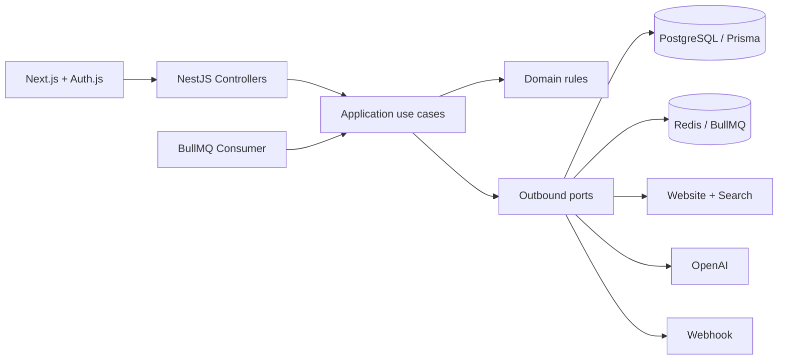

# Growth Batch OS — Caso técnico Xepelin

Pipeline end-to-end para transformar batches de empresas en pipeline ejecutable para SDRs: valida, deduplica, enriquece contactabilidad, recopila contexto público y genera un approach personalizado con AI.

La implementación prioriza **claridad, capacidad de prueba y velocidad de entrega**. Usa arquitectura hexagonal sólo en límites que realmente pueden fallar o cambiar —DB, cola, búsqueda, LLM y webhook— evitando abstracciones ceremoniales.

## Qué incluye

- API NestJS con los cuatro endpoints solicitados.
- Worker persistente BullMQ con concurrencia, retries y manejo de jobs estancados.
- PostgreSQL/Prisma con batches, leads, eventos y entregas de webhook.
- Frontend Next.js protegido por Auth.js, con login demo o Google OAuth.
- AI-enrichment estructurado y validado con Zod.
- Providers demo determinísticos para ejecutar los 20 leads sin credenciales.
- Providers live para homepage + Brave Search + OpenAI Responses API.
- Protección básica contra SSRF, timeouts e idempotency key del webhook.
- Tests del dominio y del caso de uso principal.

## Arquitectura



El dominio no importa NestJS, Prisma, BullMQ ni OpenAI. `@xepelin/core` concentra reglas y casos de uso; `@xepelin/infrastructure` implementa los adaptadores; API y worker son adaptadores de entrada.

### State machine

```text
pending → processing → ready → ai_enriching → ai_ready
                    ↘ failed              ↘ ai_failed
```

Los estados sólo cambian mediante `LeadRepository.transition`, que valida la máquina de estados y usa compare-and-set en PostgreSQL. Cada cambio queda trazado en `BatchEvent`.

## Arranque local

Requisitos: Node 20+, pnpm 9+, Docker Desktop.

```bash
cp .env.example .env
docker compose up -d postgres redis
pnpm install
pnpm db:generate
pnpm db:migrate
pnpm dev
```

Servicios:

- UI: <http://localhost:3000>
- API: <http://localhost:3001/api>
- Health: <http://localhost:3001/health>

Entrar con **Entrar al demo**. Luego usar **Ejecutar batch demo** o:

```bash
pnpm demo:seed
```

Resultado esperado del Anexo A:

- 20 leads totales.
- 16 `ai_ready`.
- 2 `failed/duplicate`.
- 1 `failed/invalid_url`.
- 1 `failed/invalid_url` por website vacío.
- Batch `completed` y una entrega lógica de webhook.

## API

### `POST /api/batches`

```json
{
  "name": "Outbound MX - Batch demo Q1",
  "segment": "pyme_servicios",
  "owner_email": "sdr.demo@xepelin.com",
  "webhook_url": "https://webhook.site/uuid",
  "leads": [
    {
      "legal_id": "MAGE920101AB1",
      "legal_name": "Manufacturas Aguila SA de CV",
      "website": "https://manufacturasaguila.mx"
    }
  ]
}
```

### Otros endpoints

- `GET /api/batches`: listado con métricas.
- `GET /api/batches/:id`: detalle, leads, eventos y webhooks.
- `POST /api/batches/:id/retry-failed`: reinicia sólo fallos reintentables.

Los errores permanentes (`duplicate`, `invalid_url`, `missing_legal_id`) se reportan como `skipped`; timeouts, rate limits, 5xx y errores transitorios de providers pueden reintentarse.

## Providers demo y live

El modo por defecto es reproducible:

```env
AI_PROVIDER=demo
PUBLIC_INFO_PROVIDER=demo
```

Para ejecutar providers reales:

```env
AI_PROVIDER=openai
PUBLIC_INFO_PROVIDER=live
WEBHOOK_PROVIDER=live
OPENAI_API_KEY=...
OPENAI_MODEL=gpt-5-mini-2025-08-07
BRAVE_SEARCH_API_KEY=...
```

El adapter OpenAI usa Responses API + Structured Outputs y vuelve a validar el resultado con Zod. Se usa un snapshot de `gpt-5-mini` para controlar regresiones; el modelo soporta Structured Outputs y su precio publicado es USD 0,25/M tokens de entrada y USD 2/M de salida: <https://developers.openai.com/api/docs/models/gpt-5-mini>.

### Prompt

El system prompt impone cuatro restricciones:

1. Usar exclusivamente evidencia entregada.
2. No inventar facturación, dolores financieros ni eventos.
3. Declarar el dolor como hipótesis.
4. Evaluar fit con pagos, gestión financiera y capital de trabajo.

Output obligatorio:

```ts
{
  prospect_fit_score: number; // 0-100
  fit_justification: string;
  ice_breaker: string;
  pain_hypothesis: string;
  confidence: "low" | "medium" | "high";
  evidence: string[];
}
```

## Confiabilidad y seguridad

- Jobs BullMQ: tres intentos con backoff exponencial.
- Cada lead falla de forma independiente; no aborta el batch.
- Webhook: un evento lógico, hasta tres intentos e `Idempotency-Key: batch:<id>:completed`.
- URLs HTTP(S) solamente, bloqueo de localhost/redes privadas y timeout.
- No se envían datos personales ni secretos al prompt.
- Logs estructurados por batch/job/lead en los límites de entrada.
- `webhookSentAt` evita un segundo evento después de reintentar leads.

Semántica del webhook: **at-least-once**. La idempotency key permite que el receptor deduplique si el request llegó pero la respuesta se perdió.

## Evaluación AI en producción

1. Golden set de 50–100 empresas balanceadas por país/segmento.
2. Schema-valid rate ≥99%.
3. Groundedness y relevancia humana de 1–5; tasa de afirmaciones sin evidencia.
4. Precision@K del ranking de fit.
5. LLM-as-judge sólo como detector de regresiones.
6. Feedback útil/no útil del SDR.
7. A/B sobre response rate y enrolamientos.

### Costo aproximado a 10K empresas/mes

Supuesto: 2.000 tokens de entrada + 250 de salida por empresa.

```text
Entrada: 20M × USD 0,25/M = USD 5
Salida:  2,5M × USD 2/M = USD 5
LLM estimado:                 USD 10/mes
```

Búsqueda e infraestructura probablemente dominan el costo. Orden de optimización: cache por contenido/dominio, refrescar sólo registros vencidos, no llamar al LLM sin evidencia, compactar prompt, usar modelos pequeños y Batch API para trabajos no urgentes.

## Deploy en Railway

Crear un proyecto con PostgreSQL y Redis, y tres servicios conectados al mismo repositorio. No configurar un root directory: API, worker y web comparten los packages del workspace.

| Servicio | Start command | Puerto |
|---|---|---|
| API | `sh -c 'pnpm db:deploy && pnpm start:api'` | `PORT=3001` |
| Worker | `pnpm start:worker` | — |
| Web | `pnpm start:web` | `PORT=3000` |

Variables de API y worker:

```env
DATABASE_URL=${{Postgres.DATABASE_URL}}
REDIS_URL=${{Redis.REDIS_URL}}
AI_PROVIDER=demo
PUBLIC_INFO_PROVIDER=demo
WEBHOOK_PROVIDER=demo
WEB_URL=https://<dominio-web>
PORT=3001 # sólo API
```

Variables del servicio web:

```env
API_URL=https://<dominio-api>/api
NEXT_PUBLIC_API_URL=https://<dominio-api>/api
NEXTAUTH_URL=https://<dominio-web>
NEXTAUTH_SECRET=<secreto-aleatorio>
AUTH_DEMO_MODE=true
PORT=3000
```

Generar dominios públicos sólo para API y web. El worker se comunica con PostgreSQL y Redis mediante private networking y no necesita dominio.

Para Google OAuth, agregar `GOOGLE_CLIENT_ID` y `GOOGLE_CLIENT_SECRET`; en producción usar allowlist/dominio corporativo. El modo credentials existe sólo para el demo sintético.

## Verificación

Demo pública:

- UI: <https://web-production-43317.up.railway.app>
- API health: <https://xepelin-growth-case-production.up.railway.app/health>
- Evidencia reproducible de deploy, batch y webhook HTTP: [docs/VALIDATION.md](docs/VALIDATION.md)

```bash
pnpm test
pnpm typecheck
pnpm build
```

## Trade-offs del MVP

Deliberadamente fuera: RBAC completo, multi-tenancy, deduplicación probabilística global, scraping masivo, reconciliador outbox, tracing distribuido e infraestructura como código. La siguiente mejora técnica sería un transactional outbox para eliminar la ventana entre commit del batch y enqueue del job.

El esfuerzo total superó el objetivo de 4–6 horas porque se añadió hardening de deploy, evidencia de webhook live y QA final. La declaración completa de alcance, uso de Codex y consumo de **0 tokens de LLM en la demo** está en [docs/DELIVERY_NOTES.md](docs/DELIVERY_NOTES.md).

## Estrategia Growth

El diagnóstico, priorización, experimento y build-vs-buy están documentados en [docs/GROWTH_STRATEGY.md](docs/GROWTH_STRATEGY.md). La presentación final está en [output/slides/xepelin-growth-engineer-case-final.pptx](output/slides/xepelin-growth-engineer-case-final.pptx).
